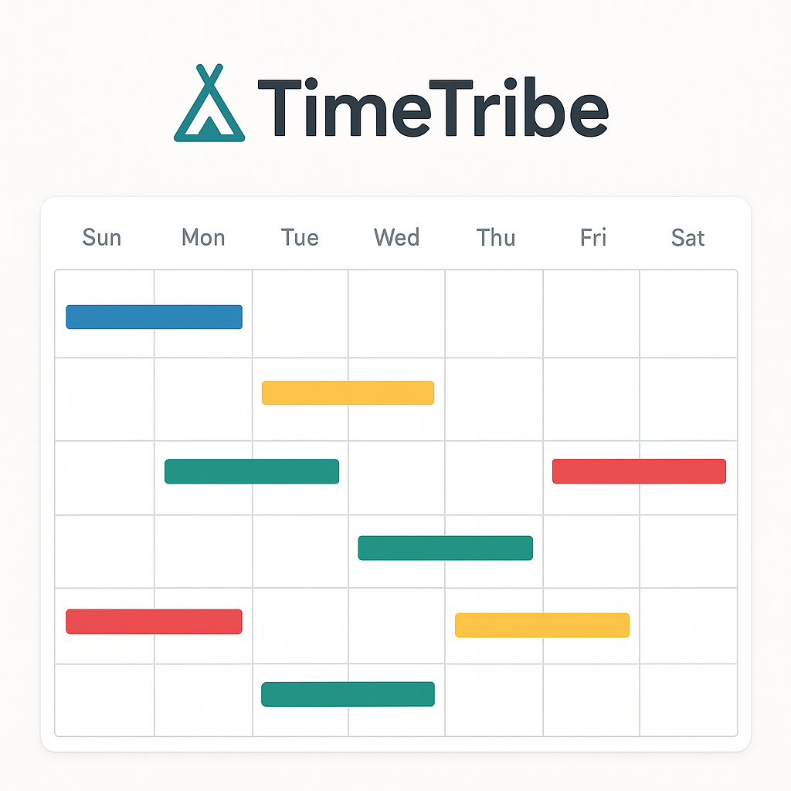

# Time Tribe - Multi-User Availability Calendar



A beautiful, real-time multi-user availability calendar built with Vue 3, Vuetify, and Supabase. Perfect for coordinating schedules with groups.

## ✨ Features

- 🎨 **Beautiful UI** - Modern gradient hero with prominent logo
- 👥 **Multi-User Support** - Track availability for multiple users
- 🎨 **Color-Coded Dates** - Each user has a unique color theme
- ⚡ **Real-Time Sync** - Changes appear instantly across all devices
- 📱 **Responsive Design** - Works on desktop, tablet, and mobile
- 📅 **Dynamic Dates** - Automatically shows current month + 3 months ahead
- ⚙️ **Easy Configuration** - Single config file for all settings

## 🚀 Quick Start

```bash
# Install dependencies
npm install

# Set up environment variables (copy .env.example to .env)
# Add your Supabase credentials

# Run development server
npm run dev
```

## 📚 Documentation

**[→ Read Complete Documentation](./DOCS.md)**

The complete documentation includes:
- Detailed setup instructions
- Supabase configuration
- User and color customization
- Deployment guides (Vercel, Netlify, GitHub Pages)
- Project structure
- Troubleshooting

## ⚙️ Quick Configuration

Edit `config.js` to customize users and colors:

```javascript
users: [
  { name: 'Tamara & Rob', color: '#9C27B0', displayColor: '#7B1FA2' },
  { name: 'Rachel', color: '#4CAF50', displayColor: '#388E3C' },
  { name: 'Jessica', color: '#E91E63', displayColor: '#C2185B' },
  { name: 'Tim', color: '#2196F3', displayColor: '#1976D2' },
  { name: 'Joseph', color: '#FF9800', displayColor: '#F57C00' }
]
```

## 🚢 Deploy

**Vercel** (Recommended):
```bash
vercel
```

**Netlify**:
```bash
npm run build
netlify deploy --prod --dir=dist
```

## 🛠️ Tech Stack

- Vue 3 + Composition API
- Vuetify 3 (Material Design)
- Supabase (Database + Real-time)
- V-Calendar
- Vite

---

**Built with ❤️ for easy group coordination**

## ✨ Features

- 🎨 **Beautiful Dark Mode UI** - Modern Material Design with Vuetify
- 👥 **Multi-User Support** - Track availability for multiple users/couples
- 🎨 **Color-Coded Dates** - Each user has a unique color
- ⚡ **Real-Time Sync** - Changes appear instantly across all devices
- 📱 **Responsive Design** - Works perfectly on desktop, tablet, and mobile
- 🌍 **Timezone Safe** - Dates display correctly regardless of timezone
- ⚙️ **Easy Configuration** - Simple config file for users and date ranges

## 🚀 Quick Start

### Prerequisites

- Node.js 18+ installed
- A Supabase account (free tier works great)

### 1. Clone and Install

```bash
# Navigate to the project directory
cd timetribe

# Install dependencies
npm install
```

### 2. Set Up Supabase

1. Create a free account at [supabase.com](https://supabase.com)
2. Create a new project
3. In the SQL Editor, run this schema:

```sql
CREATE TABLE user_availability (
    id BIGSERIAL PRIMARY KEY,
    user_name TEXT NOT NULL,
    selected_date DATE NOT NULL,
    created_at TIMESTAMPTZ DEFAULT NOW(),
    updated_at TIMESTAMPTZ DEFAULT NOW(),
    UNIQUE(user_name, selected_date)
);

-- Create indexes for performance
CREATE INDEX idx_user_availability_user_name ON user_availability(user_name);
CREATE INDEX idx_user_availability_selected_date ON user_availability(selected_date);
CREATE INDEX idx_user_availability_composite ON user_availability(user_name, selected_date);

-- Enable Row Level Security (RLS)
ALTER TABLE user_availability ENABLE ROW LEVEL SECURITY;

-- Create policy to allow all operations (public access)
CREATE POLICY "Allow all operations on user_availability"
    ON user_availability
    FOR ALL
    USING (true)
    WITH CHECK (true);

-- Enable real-time
ALTER PUBLICATION supabase_realtime ADD TABLE user_availability;
```

4. Get your credentials from Project Settings > API:
   - Project URL
   - Anon/Public Key

5. Update the `.env` file with your credentials (already created with your values)

### 3. Configure Users and Date Range

Edit `config.js` to customize:

**Add/Remove Users:**
```javascript
users: [
  {
    name: 'Flint & Maryam',
    color: '#2196F3',        // Calendar highlight color
    displayColor: '#1976D2',  // UI element color
    textColor: '#FFFFFF'
  },
  // Add more users here...
]
```

**Change Date Range:**
```javascript
dateRange: {
  startMonth: 10,    // October (1-12)
  startYear: 2025,
  endMonth: 12,      // December (1-12)
  endYear: 2025
}
```

### 4. Run the Development Server

```bash
npm run dev
```

Open your browser to `http://localhost:3000` 🎉

## 📁 Project Structure

```
timetribe/
├── config.js                 # ⚙️ Main configuration file (EDIT THIS!)
├── .env                      # 🔐 Supabase credentials
├── index.html                # Entry HTML
├── package.json              # Dependencies
├── vite.config.js            # Vite configuration
├── public/
│   └── timetribe_logo.png   # App logo (replace with your own)
└── src/
    ├── main.js               # App initialization
    ├── App.vue               # Main app component
    ├── components/
    │   ├── UserSelector.vue  # User selection UI
    │   ├── Calendar.vue      # Calendar component
    │   └── LoadingState.vue  # Loading indicator
    └── composables/
        ├── useSupabase.js    # Database operations
        ├── useUsers.js       # User state management
        └── useDates.js       # Date utilities
```

## 🎨 Customization Guide

### Change Users

Edit `config.js`:

```javascript
users: [
  {
    name: 'Your Names',           // Display name
    color: '#FF5722',             // Any hex color
    displayColor: '#E64A19',      // Darker shade for UI
    textColor: '#FFFFFF'          // White or black for contrast
  }
]
```

### Change Date Range

Edit `config.js`:

```javascript
dateRange: {
  startMonth: 1,     // January
  startYear: 2026,
  endMonth: 3,       // March
  endYear: 2026
}
```

### Change Theme

Edit `config.js`:

```javascript
ui: {
  theme: 'light',  // Change to 'light' for light mode
  // ... other options
}
```

### Replace Logo

Replace `public/timetribe_logo.png` with your own logo (recommended: 512x512px PNG)

## 🔧 How It Works

### User Selection
- Click on any user chip to make them active
- Active user is highlighted in their color
- All date selections apply to the active user

### Date Selection
- Click any date to toggle availability
- Click again to remove
- Changes save automatically to Supabase
- See all users' dates color-coded on the calendar

### Real-Time Updates
- When anyone makes a change, all browsers update automatically
- Connection status shown in the footer
- Works across all devices simultaneously

## 📦 Building for Production

```bash
# Build the app
npm run build

# Preview the production build
npm run preview
```

The built files will be in the `dist/` folder.

## 🚀 Deployment

### Deploy to GitHub Pages

1. Update `vite.config.js` and uncomment the base path:
   ```javascript
   base: '/timetribe/',  // Use your repository name
   ```

2. Deploy:
   ```bash
   npm run deploy
   ```

### Deploy to Netlify

1. Connect your GitHub repository to Netlify
2. Build command: `npm run build`
3. Publish directory: `dist`
4. Add environment variables in Netlify dashboard

### Deploy to Vercel

1. Connect your GitHub repository to Vercel
2. Framework preset: Vite
3. Build command: `npm run build`
4. Output directory: `dist`
5. Add environment variables in Vercel dashboard

## 🐛 Troubleshooting

### Dates appear shifted by one day
- This is a timezone issue. The app uses the `PureDate` utility to prevent this.
- If you still see issues, check the browser console for errors.

### Real-time updates not working
1. Check that real-time is enabled in Supabase dashboard
2. Verify the SQL command `ALTER PUBLICATION supabase_realtime ADD TABLE user_availability;` was run
3. Check browser console for connection errors

### Can't save to database
1. Verify `.env` file has correct Supabase credentials
2. Check RLS policies in Supabase (should allow all operations)
3. Check browser console for error messages

### Logo not showing
- Make sure `public/timetribe_logo.png` exists
- Try refreshing the page
- Check browser console for 404 errors

## 🔐 Security Notes

- This app uses public access (no authentication) by design
- Anyone with the URL can view and modify dates
- For private use, consider adding authentication via Supabase Auth
- The anon key is safe to expose in frontend code

## 🛠️ Tech Stack

- **Frontend Framework:** Vue 3 (Composition API)
- **UI Library:** Vuetify 3 (Material Design)
- **Calendar:** V-Calendar 3
- **Database:** Supabase (PostgreSQL)
- **Real-Time:** Supabase Realtime
- **Build Tool:** Vite
- **Language:** JavaScript (ES6+)

## 📝 Available Scripts

```bash
npm run dev       # Start development server
npm run build     # Build for production
npm run preview   # Preview production build
npm run deploy    # Deploy to GitHub Pages
```

## 🤝 Contributing

This is a personal project, but feel free to fork and customize for your needs!

## 📄 License

MIT License - feel free to use this for your own projects.

## 💡 Future Enhancements

- [ ] Add authentication
- [ ] Export to ICS calendar files
- [ ] Email notifications
- [ ] Comments on dates
- [ ] Conflict detection
- [ ] Date range selection
- [ ] History/audit log

## 📞 Support

If you encounter any issues:

1. Check the troubleshooting section above
2. Review the browser console for errors
3. Verify your Supabase setup
4. Check that all dependencies installed correctly

---

**Made with ❤️ for coordinating availability with friends and family**

🎉 **Enjoy using Time Tribe!**
